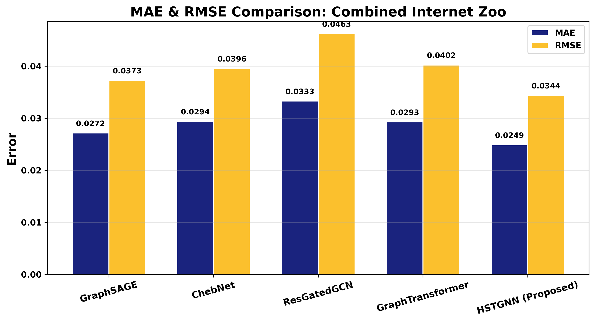

# HSTGNN Network Digital Twin

ThE repository runs the HSTGNN experiment for Network Digital Twins and generates:

- `ndt_results.csv`
- `bar_r2_score.png`
- `bar_mae_rmse.png`
- `radar_chart.png`
- `training_curves.png`
- `scatter_pred_vs_actual.png`
- topology visualisations

## Repository Structure

- `ndt_experiment.py`: main command-line entrypoint
- `ndt_project/pipeline.py`: core experiment implementation
- `requirements.txt`: Python dependencies
- `run_experiment.ps1`: simple PowerShell runner for the default single experiment

## Before Running Anything

We download the Internet Topology Zoo dataset and place it in the working directory with this exact folder layout:

`3D-internet-zoo-master/3D-internet-zoo-master/dataset (here: https://github.com/afourmy/3D-internet-zoo)`

In other words, after downloading and extracting the topology archive, our project folder should contain:

```text
your-working-directory/
├── ndt_experiment.py
├── ndt_project/
├── requirements.txt
├── run_experiment.ps1
└── 3D-internet-zoo-master/
    └── 3D-internet-zoo-master/
        └── dataset/
            ├── Aarnet.gml
            ├── Abilene.gml
            ├── ...
```

## Setup Instructions

Recommended Python version: `Python 3.11`

### Windows PowerShell

We open PowerShell in the project folder and run:

```powershell
py -3.11 -m venv .venv
.\.venv\Scripts\Activate.ps1
python -m pip install --upgrade pip
python -m pip install -r requirements.txt
```

## Running the Experiment
```
Single combined-topology run:

```powershell
python ndt_experiment.py --mode single --single-output-dir zoo_results
```

Multi-topology suite:

```powershell
python ndt_experiment.py --mode multi --output-root multi_topology_runs
```

## Expected Outputs

### Single run

The folder `zoo_results/` will contain:

- `ndt_results.csv`
- `bar_r2_score.png`
- `bar_mae_rmse.png`
- `radar_chart.png`
- `training_curves.png`
- `scatter_pred_vs_actual.png`
- `network_topology.png`
- `network_topology_geo.png`

### Multi run

The folder `multi_topology_runs/` will contain:

- one results folder per topology
- a combined CSV summary
- a topology gallery image
## Sample Results
 
## Notes

- `ndt_experiment.py` is a thin entrypoint. The main experiment logic lives in `ndt_project/pipeline.py`.
- The experiment uses a fixed seed by default for reproducibility.
- If CUDA is available, PyTorch will use it automatically; otherwise the run falls back to CPU.
